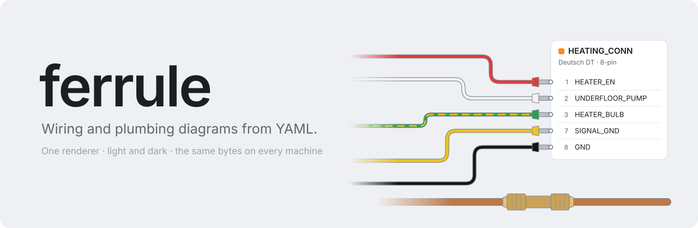
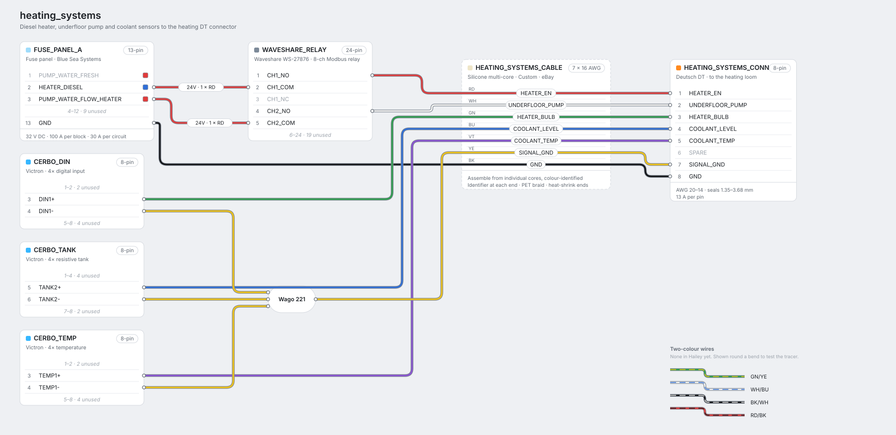
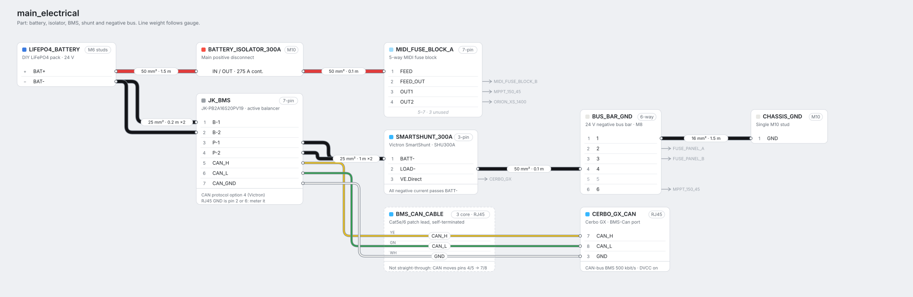
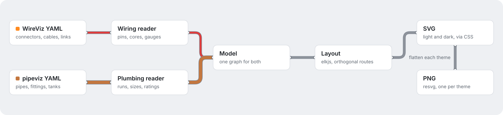

  <picture>
    <source media="(prefers-color-scheme: dark)" srcset="docs/assets/banner-dark.svg">
    
  </picture>

  <b>A diagram renderer for looms and pipe runs.</b> 
  It reads the YAML you already have, lays out the result itself, and draws it in a style it owns.

  
  
  

---

ferrule turns [WireViz](https://github.com/wireviz/WireViz) and
[pipeviz](https://github.com/XDGFX/pipeviz) YAML into diagrams. Your existing files stay as they
are. ferrule replaces the Graphviz step that draws them.

> [!NOTE]
> Nothing here runs yet. The look is settled, and the layout spike is next.

## Why

- **One look, controlled here.** Graphviz has no CSS and no per-corner radii. It can't outline
  a black wire on a dark ground, draw a tracer on a two-colour wire, or route filleted orthogonal
  wires out of table ports.
- **The same bytes on every machine.** Graphviz measures text with whatever fonts happen to be
  installed, so the same YAML renders differently on a laptop and a CI runner. ferrule bundles
  its font and measures text itself, so CI can diff SVGs byte for byte.
- **Real dark mode.** SVGs carry CSS variables and `prefers-color-scheme`. PNGs come in light and
  dark, because some viewers, including the GitHub mobile app, show PNGs but not SVGs.
- **Wiring and plumbing match.** One core, two readers.

## What it looks like

The style is called *Instrument*. Below is a heating loom, mocked up by hand before any layout
engine existed.

<picture>
  <source media="(prefers-color-scheme: dark)" srcset="docs/assets/heating_systems-a-dark.svg">
  
</picture>

Battery, BMS and negative bus, where line weight follows gauge

 
<picture>
  <source media="(prefers-color-scheme: dark)" srcset="docs/assets/main_electrical-a-dark.svg">
  
</picture>

## The drawing rules

| | Rule |
|---|---|
| **Cards** | One card per component. A colour chip identifies it, and the card lists its pins. Runs of unused pins fold into one row, such as `6–24 · 19 unused`. |
| **Wires** | Orthogonal with filleted corners. Every core has a hairline casing. Black and white cores get their own casing colour in each theme, so they never disappear. |
| **Two-colour wires** | The base colour, with a dashed tracer in the second colour that follows the wire round each bend. |
| **Gauge** | Line weight follows conductor size, so a 50 mm² run looks like one. |
| **Single-core runs** | A tag on the wire, such as `50 mm² · 1.5 m`, not a separate box. |
| **Multi-core cables** | A dashed card that the cores pass straight through, each labelled on its wire. |
| **Off-sheet ends** | An arrow naming the other end, such as `→ MPPT_150_45`, instead of a wire that just stops. |
| **Type** | Inter, bundled and measured in-process. |

## How it fits together

<picture>
  <source media="(prefers-color-scheme: dark)" srcset="docs/assets/pipeline-dark.svg">
  
</picture>

Each reader handles one schema. Everything after the model is shared, so wiring and plumbing
diagrams come out of the same layout and drawing code. PNGs go through a flattened copy of the
SVG with literal colours, one per theme, because resvg can't resolve CSS variables.

**Fallback:** if ELK's layouts turn out worse than Graphviz's, ferrule keeps `dot -Tjson` for
layout only and still draws everything itself. That keeps the look and dark mode, but output would
no longer be identical across machines.

## Roadmap

- [x] **Look.** Three style directions were built by hand and checked on a phone, and *Instrument* was chosen.
- [ ] **Layout spike.** Lay out a large, dense loom with elkjs and compare it with `dot -Tjson`. This is the go/no-go point.
- [ ] **Parity.** Render a full set of real diagrams beside the old WireViz output until every one is correct.
- [ ] **New outputs.** Pinout tables per connector in Markdown, a cut list, and gauge checks against terminal and fuse limits.
- [ ] **Plumbing.** Port pipeviz onto the same core.

## Not planned

- Physical layout or formboard views
- Net highlighting, because it needs JavaScript and GitHub won't run it
- Export to `.harness` or any other editor format

## Origin

ferrule started on a campervan build that documents its 24 V system and plumbing in WireViz and
pipeviz YAML. That project needed diagrams that read well on a phone in the van, a dark mode, and
a CI check that the committed diagrams still match their YAML. Graphviz couldn't give it any of
those.

`docs/assets/` is generated. `scripts/make_readme_art.py` draws the banner and the pipeline.
The example diagrams are hand-built mock-ups made before the layout engine existed.
