# Layout spike results

Generated by `node spike/run.ts`. Do not edit by hand.

## main_electrical

21 cards, 37 wires.  

| | elkjs | dot -Tjson |
|---|---|---|
| Canvas (px) | 2839 × 1489 | 2397 × 1500 |
| Total wire length (px) | 9858 | 7874 |
| Bends | 52 | – |
| Crossings | 12 | 14 |
| Wires through a card | 0 | 0 |
| Tags over a card or tag | 0 | 0 |
| Layout time (ms) | 246 | 71 |

ELK output byte-identical across two runs: **yes**.
